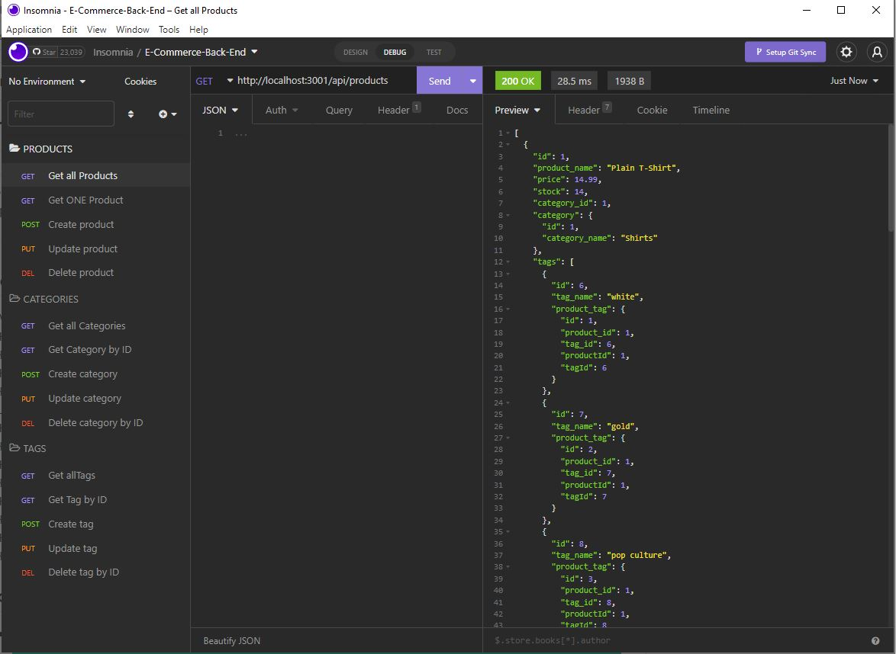

# 13-E-Commerce-Back-End

The task is to build the back end for an e-commerce site by modifying starter code by configuring a working Express.js API to use Sequelize to interact with a MySQL database.

## Acceptance Criteria

GIVEN a functional Express.js API  
WHEN I add my database name, MySQL username, and MySQL password to an environment variable file  
THEN I am able to connect to a database using Sequelize  
WHEN I enter schema and seed commands  
THEN a development database is created and is seeded with test data  
WHEN I enter the command to invoke the application  
THEN my server is started and the Sequelize models are synced to the MySQL database  
WHEN I open API GET routes in Insomnia for categories, products, or tags  
THEN the data for each of these routes is displayed in a formatted JSON  
WHEN I test API POST, PUT, and DELETE routes in Insomnia  
THEN I am able to successfully create, update, and delete data in my database

## Screenshot

The following screenshot is supposed to serve as an overview of the different CRUD operations that are part of the app. Please also refer to the video which is linked at the end of this readme to view them in use.

## Challenges

- using Sequelize to connect to a SQL database
- building models and associations using Sequelize
- understanding routes and how they interlink
- using Insomnia for testing
- understanding and using belongs to many method

## Special thanks

Special thanks to fellow boot camp student Tammi for the support this week!

## Links

- [GitHub Repository](https://github.com/HenniePenny/13-E-Commerce-Back-End)
